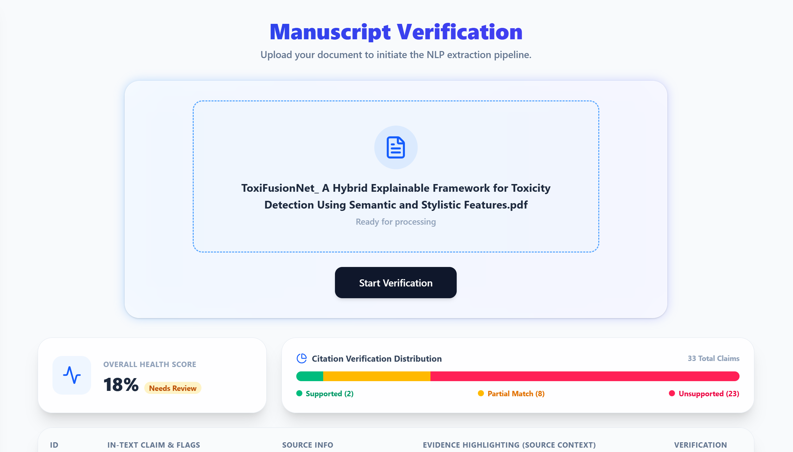
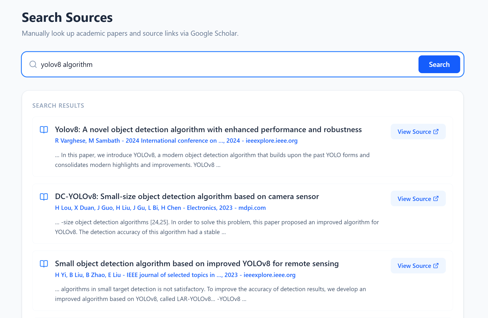

# CitationChecker

CitationChecker is an AI-powered academic citation verification system designed to analyze research manuscripts and evaluate how well cited sources support the claims made in a paper.

The system extracts citation-based claims from uploaded PDF manuscripts, maps them to bibliography references, retrieves source information using multiple academic APIs, and uses a Sentence Transformer model to generate a confidence score for each citation.

## Features

- Upload and analyze academic PDF manuscripts
- Extract citation-containing claims
- Map claims to bibliography references
- Retrieve source abstracts and metadata
- Multi-API academic source retrieval
- Sentence Transformer-based semantic verification
- Confidence scoring for individual citations
- Supported, Partial, and Unsupported classifications
- Citation verification dashboard
- Source context and evidence display
- Academic source search
- Manuscript processing history
- Google OAuth authentication
- Light and dark mode

## Technology Stack

### Frontend

- React
- Tailwind CSS
- React Router
- Lucide React
- Vite
- Google OAuth

### Backend

- Node.js
- Express.js
- SQLite
- Multer
- Axios

### NLP Engine

- Python
- PyMuPDF
- spaCy
- PyTorch
- Transformers
- Sentence Transformers

## System Architecture

```text
                         CitationChecker
                                |
                 +--------------+--------------+
                 |                             |
                 v                             v
          React Frontend                Express Backend
          React + Tailwind              Node.js + API
                 |                             |
                 +--------------+--------------+
                                |
                                v
                         SQLite Database
                                |
                                v
                         Python NLP Engine
                                |
                 +--------------+--------------+
                 |                             |
                 v                             v
          PDF & Citation NLP            Source Retrieval
                                                |
                          +---------------------+---------------------+
                          |           |             |                 |
                          v           v             v                 v
                       OpenAlex   Semantic      CrossRef       Google Scholar
                                  Scholar                      via SerpAPI
```

## NLP Pipeline

CitationChecker processes an uploaded manuscript through several stages.

### 1. PDF Text Extraction

**PyMuPDF** is used to extract text from the uploaded PDF.

The document is divided into the main manuscript body and the reference section. The system looks for headings such as:

```text
References
Bibliography
Works Cited
```

### 2. Citation Detection and Context Extraction

**spaCy** is used to segment the manuscript into sentences.

Citation patterns such as:

```text
[1]
[2]
[1, 2]
[3-5]
```

are detected in the manuscript.

Each citation-containing sentence is extracted as a claim and mapped to the corresponding bibliography entry.

CitationChecker also captures the surrounding context of the claim by taking the previous, current, and next sentence from the uploaded manuscript. This context is displayed in the verification interface as evidence from the user's paper.

### 3. Source Retrieval

CitationChecker uses a fallback-based academic source retrieval pipeline.

#### OpenAlex

OpenAlex is the primary source retrieval service.

It is used to search for the referenced research work and retrieve:

- Paper title
- Authors
- Abstract

OpenAlex abstracts can be returned as an inverted index, so the NLP engine reconstructs the abstract into readable text before verification.

#### Semantic Scholar

Semantic Scholar is used as the second retrieval method when a suitable source or abstract is not obtained from OpenAlex.

It provides:

- Paper title
- Abstract
- Author information

#### CrossRef

CrossRef provides another fallback source for publication metadata and abstracts.

The system retrieves:

- Paper title
- Authors
- Abstract

CrossRef abstract markup is cleaned before the text is passed to the verification stage.

#### Google Scholar through SerpAPI

Google Scholar is used as the final fallback through the application's SerpAPI route.

It can provide:

- Search result title
- Author information
- Search snippet
- Direct source link

This is particularly useful when an openly accessible abstract is unavailable.

The overall retrieval order is:

```text
OpenAlex
   ↓
Semantic Scholar
   ↓
CrossRef
   ↓
Google Scholar / SerpAPI
```

## Sentence Transformer Verification

The main semantic verification component uses the Sentence Transformer model:

```text
all-mpnet-base-v2
```

Sentence Transformers convert text into dense numerical embeddings that capture semantic meaning.

For every citation, the system generates:

```text
Citation Claim
      ↓
Sentence Transformer
(all-mpnet-base-v2)
      ↓
Claim Embedding

External Source Abstract
      ↓
Sentence Transformer
(all-mpnet-base-v2)
      ↓
Source Embedding
```

The two embeddings are compared using the similarity function provided by the Sentence Transformers library.

The resulting similarity value is converted into a percentage confidence score between 0 and 100.

This score represents how closely the meaning of the extracted citation claim aligns with the retrieved source abstract.

## Confidence Scoring

The generated confidence score is classified into three verification categories:

| Confidence Score | Verification Status |
|------------------:|---------------------|
| ≥ 55% | Supported |
| 30%–54.99% | Partial |
| < 30% | Unsupported |

### Supported

A score of 55% or higher indicates a strong semantic relationship between the citation claim and the retrieved source content.

### Partial

A score between 30% and 54.99% indicates some semantic relationship, but the citation may require additional manual examination.

### Unsupported

A score below 30% indicates insufficient semantic similarity between the claim and the retrieved source.

The score is an automated screening measure and is intended to assist academic review rather than replace human judgment.

## NLP Models and Libraries

### Sentence Transformer

```text
all-mpnet-base-v2
```

This is the model used by the current verification function to create sentence embeddings for the citation claim and external source abstract.

### DeBERTa NLI Model

```text
cross-encoder/nli-deberta-v3-small
```

This Transformer model is also loaded in the NLP engine as part of the current NLP setup.

### spaCy

```text
en_core_web_sm
```

spaCy is used for sentence segmentation and identifying individual sentences within the extracted manuscript text.

## Database

CitationChecker uses SQLite for application data storage.

### Tables

```text
papers
sources
claims
users
sqlite_sequence
```

The main tables store uploaded manuscripts, retrieved sources, extracted claims and verification results, and authenticated users.

## Project Structure

```text
citationChecker/
│
├── backend/
│   ├── uploads/
│   ├── database.sqlite
│   ├── index.js
│   └── package.json
│
├── nlp_engine/
│   ├── venv/
│   └── extract.py
│
├── public/
│
├── src/
│   ├── assets/
│   │
│   ├── components/
│   │   └── Sidebar.jsx
│   │
│   ├── screens/
│   │   ├── Welcome.jsx
│   │   ├── Upload.jsx
│   │   ├── History.jsx
│   │   └── Search.jsx
│   │
│   ├── App.jsx
│   ├── App.css
│   ├── index.css
│   └── main.jsx
│
├── .gitignore
├── eslint.config.js
├── index.html
├── package.json
└── README.md
```

## API Endpoints

| Method | Endpoint | Purpose |
|--------|----------|---------|
| GET | `/api/health` | Check backend status |
| POST | `/api/upload` | Upload a manuscript and start processing |
| GET | `/api/results/:paperId` | Retrieve processing status and results |
| GET | `/api/history` | Retrieve manuscript history |
| GET | `/api/search` | Search academic sources through SerpAPI |
| POST | `/api/auth/google` | Store or update Google user information |

## Processing Workflow

```text
Upload PDF
    ↓
Extract Manuscript Text
    ↓
Separate Body and References
    ↓
Detect Citation-Based Claims
    ↓
Map Claims to References
    ↓
Retrieve Source Information
    ↓
OpenAlex → Semantic Scholar → CrossRef → SerpAPI
    ↓
Retrieve External Abstract
    ↓
Generate Sentence Embeddings
    ↓
Calculate Semantic Similarity
    ↓
Generate Confidence Score
    ↓
Classify Citation
    ↓
Store Results in SQLite
    ↓
Display Verification Dashboard
```

## Frontend Screens

### Welcome
Landing page for the CitationChecker application.


### Upload Paper
Allows users to upload a PDF and view the citation verification results, confidence scores, source information, and evidence context.




### History
Displays previously processed manuscripts and their processing information.


### Search Sources
Allows users to search academic sources using the Google Scholar and SerpAPI integration.


## Author

**Sadana**
